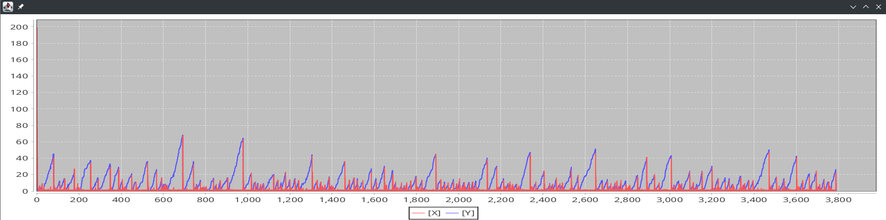

# Asmd exam report

## Lab 1: Acceptance testing

### Calculator

This task asked to apply ATDD techniques to implement a calculator.

For this porpouse, I've written a *feature* file per each mathematical operation the calculator should support: *addition*, *subtraction*, *multiplication*, *division*.

For the automation of the acceptance tests, I used the [*Cucumber*](https://cucumber.io/) framework, which is a BDD tool that allows to write feature files in a human-readable language ([Gherkin](https://cucumber.io/docs/gherkin/reference/)) and to implement the steps in a programming language.

Here is an example of the *addition* feature file:

```gherkin
Feature:  Adding numbers with a Calculator
  In order to not learn math
  As someone who is bad at math
  I want to be able to add numbers using a Calculator

  Scenario:  Add two positive numbers
    Given I have a Calculator
    When I add 1 and 1
    Then the result of the addition should be 2

  Scenario:  Add a positive and negative number
    Given I have a Calculator
    When I add 1 and -1
    Then the result of the addition should be 0

  Scenario:  Add two negative numbers
    Given I have a Calculator
    When I add -1 and -1
    Then the result of the addition should be -2
```

In the implementation of the steps, I was concerned with the application of the DRY principle. Luckily, the *Cucumber* framework allows to define *step definitions* that can be reused across different feature files.

### Reeingineer

For the implementation of the Step Definition there was no need to refactor the system, but, I had to implement some private utility methods to perform automated actions and to check some of the system state conditions.

In order to be (automatically) testable, an artifact should provide an API to interact with it and check its conditions. When using Cucumber in particular, the API should adhere to the **Prepare, Act, Assert** pattern.

### Require

For this task I imagined that a web system for the management of a basketball federation activities (seasonal tournaments, teams, players, etc.) had to be developed. The result was the production of the following feature files:

* [ChampionshipCreation.feature](https://github.com/kelvin-olaiya/asmd-lab-01/blob/master/src/test/resources/features/BasketballSystem/ChampionshipCreation.feature)
* [ChampionshipOrganization.feature](https://github.com/kelvin-olaiya/asmd-lab-01/blob/master/src/test/resources/features/BasketballSystem/ChampionshipOrganization.feature)
* [ChampionshipRegistration.feature](https://github.com/kelvin-olaiya/asmd-lab-01/blob/master/src/test/resources/features/BasketballSystem/ChampionshipRegistration.feature)
* [MatchResultApproval.feature](https://github.com/kelvin-olaiya/asmd-lab-01/blob/master/src/test/resources/features/BasketballSystem/MatchResultApproval.feature)
* [PlayerRegistration.feature](https://github.com/kelvin-olaiya/asmd-lab-01/blob/master/src/test/resources/features/BasketballSystem/PlayerRegistration.feature)
* [PlayerMembership.feature](https://github.com/kelvin-olaiya/asmd-lab-01/blob/master/src/test/resources/features/BasketballSystem/PlayerMembership.feature)
* [PlayerEndingMembership.feature](https://github.com/kelvin-olaiya/asmd-lab-01/blob/master/src/test/resources/features/BasketballSystem/PlayerEndingMembership.feature)
* [TeamAffiliation.feature](https://github.com/kelvin-olaiya/asmd-lab-01/blob/master/src/test/resources/features/BasketballSystem/TeamAffiliation.feature)

**Some considerations**:

* I believe that well written feature files can be useful for better understanding the requirements of a system, and for the communication between the stakeholders and the development team. They're like examples, provided by a stakeholder, of how the system should behave.
* Each Given/When/Then step should have its related step definition. This means that there could be a lot of then when the system is complex. When developing we must be careful to avoid duplication as much as possible and to maintain a clean structure of them.

---

## Lab 2: Advanced testing

### Reengineer

Tests can be found [here](https://github.com/kelvin-olaiya/asmd-lab-02/blob/master/src/test/scala/a01a/sol2/TestGUIExamLogger.scala)

### Gui-Tester

For this task I implemented a [`GUIProbe`](https://github.com/kelvin-olaiya/asmd-lab-02/blob/master/src/main/scala/a01a/sol2/GUIProbe.scala) which wraps the system's `GUI` and provides an API to interact with it and check its conditions. The `GUIProbe` is a *Facade* that hides the complexity and technicalities of the system's GUI and provides what is needed for automated testing through a simple interface. 

As stated before to be able to test a system, the system it self should provide an API to interact with it and check its conditions
(Design for testability). 
In the case of a GUIs, unless it is specified in the requirements, most of the time we are not interested on the graphical aspect of the UI, but on the behavior. So a possibile methodology can be to abstract each graphical component as a logical component with methods to interact with it (click, drag, etc.) and to obtain its status (list model, text, etc.).

---

## Lab 4: Advanced programming

### Adt-Verifier

For this task I defined a `SimpleSequence` and a `ListSequence` ATD. The [first one](https://github.com/kelvin-olaiya/asmd-lab-04/blob/master/src/main/scala/lab/u04/SimpleSequence.scala) is backed-up by a Cons/Nil case class, while the [second one](https://github.com/kelvin-olaiya/asmd-lab-04/blob/master/src/main/scala/lab/u04/ListSequence.scala) is backed-up by a Scala List. I then implemented the map, filter, concat, flatMap, foldLeft, collect and drop methods for both ATDs. I then defined the [ScalaCheck properties](https://github.com/kelvin-olaiya/asmd-lab-04/blob/master/src/test/scala/lab/u04/SequenceADTProperties.scala) that correspond to the ATDs axioms that these methods should satisfy.

In order to easily verify that the properties hold for both of the ATDs, I defined a generic ScalaCheck property that takes a sequence and a function that should be applied to the sequence. This way, I could [easily test](https://github.com/kelvin-olaiya/asmd-lab-04/blob/master/src/test/scala/lab/u04/ADTChecks.scala) the properties for both ATDs by passing the *ModuleType* and the function to the generic property.

### Monad-Verifier

A similar methodology was used for the Monad-Verifier task. To verify that the monad laws hold the idea was to ask for a (single) function that given a monad, extracts a value from it. Then the test consist into asserting that the values produced by the left and right side of the identity laws are the same.

Test can be found [here](https://github.com/kelvin-olaiya/asmd-lab-04/blob/master/src/test/scala/lab/u04/MonadsProperties.scala)

---

## Lab 6: Modelling 

### Verifier

Given the *Readers and Writers* petri net:

```scala
  val network: System[MSet[State]] = PetriNet[State](
  MSet(IDLE) ~~> MSet(R),
  MSet(IDLE) ~~> MSet(W),
  MSet(R) ~~> MSet(RC) ^^^ MSet(WC),
  MSet(W) ~~> MSet(WC) ^^^ MSet(WC, RC),
  MSet(RC) ~~> MSet(DONE),
  MSet(WC) ~~> MSet(DONE)
  ).toSystem
```

The goal was to verify that the mutual exclusion safety property holds for the system. 
In my first approach I tried to use ScalaCheck to check that the property holds for any paht. But, I then switched to a more manual approach, by relying only on Scala Test. This is because in the ScalaCheck approach we make use of `Generator` and the idea is to pick a finite number of samples from the generator and verifying that the property holds for those samples. In this case to be sure that the property holds for all paths we would need to generate all possible paths.

For a more idiomatic way to express propertie a [`LTLPredicate`](https://github.com/kelvin-olaiya/asmd-lab-06/blob/master/src/main/scala/lab/u06/LTLPredicate.scala) trait was defined. This way we can express the property in a more readable way, similar to what is done in LTL. Thanks to the `LTLPredicate` trait we can also define liveness and fairness properties, which are properties that should hold at some point in the future, for example:

```scala
property("If a reader wants to read it will eventually surely do it"):
    safeNetwork(3).paths(MSet(R, IDLE, IDLE), 13) foreach: p =>
      if !(p satisfies state(MSet(R)) -> F(state(MSet(RC))))
      then fail("Property failed on path: " + p)

```

### Designer

To be sure that a wannabe reader will eventually surely read, my idea was to implement a sort of Barrier after the critical section. Every process after exiting from the critical section waits for any process in the system. This means that the net should be designed for an exact number of processes.

```scala
private val safeNetworkPN = PetriNet[State](
    MSet(IDLE) ~~> MSet(R) ^^^ MSet(DONE),
    MSet(IDLE) ~~> MSet(W) ^^^ MSet(DONE),
    MSet(R) ~~> MSet(RC) ^^^ MSet(WC),
    MSet(W) ~~> MSet(WC) ^^^ MSet(WC, RC),
    MSet(RC) ~~> MSet(DONE),
    MSet(WC) ~~> MSet(DONE)
  )

  def safeNetwork(nProcs: Int): System[MSet[State]] =
    (safeNetworkPN + (
      MSet.ofList(List.fill(nProcs)(DONE)) ~~>
        MSet.ofList(List.fill(nProcs)(IDLE))
    )).toSystem
```

Next there's the network that allows at most two writer process in the critical section at the same time: 

```scala
val atMostTwoWriters: System[MSet[State]] = PetriNet[State](
    MSet(IDLE) ~~> MSet(R),
    MSet(IDLE) ~~> MSet(W),
    MSet(R) ~~> MSet(RC) ^^^ MSet(WC1, WC2),
    MSet(W) ~~> MSet(WC1) ^^^ MSet(RC, WC1),
    MSet(W) ~~> MSet(WC2) ^^^ MSet(RC, WC2),
    MSet(RC) ~~> MSet(IDLE),
    MSet(WC1) ~~> MSet(IDLE),
    MSet(WC2) ~~> MSet(IDLE)
  ).toSystem
```

Tests are available [here](https://github.com/kelvin-olaiya/asmd-lab-06/blob/master/src/test/scala/lab/u06/ReadersAndWritersVerifier.scala)

### Artist

To implement a [priority petri net](https://github.com/kelvin-olaiya/asmd-lab-06/blob/master/src/main/scala/lab/u06/PriorityPetriNet.scala), every transition in the petri net is associated with a priority. When implementing the `System`s **next** function, I first determine which are the enabled transitions, then I group them by priority and finally I choose the transitions with the highest priority.

Here's an example of a priority petri net:

```scala
/**
 * T1, T2, T3 represent trains. 
 * T1 has the highest priority whereas T3 has the lowest. 
 * FJ is a token that indicates that the junction is free,
 * T1J, T2J, T3J indicates that the train is in the junction
 * OS is a token that a train is on the other side of the junction
 */
val trainJunction: System[MSet[State]] = PriorityPetriNet[State](
    MSet(T1, FJ) ~~> MSet(T1J) ### 3,
    MSet(T2, FJ) ~~> MSet(T2J) ### 2,
    MSet(T3, FJ) ~~> MSet(T3J) ### 1,
    MSet(T1J) ~~> MSet(OS, FJ) ### 3,
    MSet(T2J) ~~> MSet(OS, FJ) ### 3,
    MSet(T3J) ~~> MSet(OS, FJ) ### 3
  ).toSystem
```

path:

```txt
List({T2|T1|T3|FJ}, {T2|T3|T1J}, {T2|T3|OS|FJ}, {T2J|T3|OS}, {T3|OS|OS|FJ}, {T3J|OS|OS}, {OS|OS|OS|FJ})
```

---

## Lab 7: Stochastic modelling

### Simulator

API are available:
- in the [`Statistcs`](https://github.com/kelvin-olaiya/asmd-lab-07/blob/master/src/main/scala/u07/utils/Statistics.scala) module
- in the [`CTMCSimulation`](https://github.com/kelvin-olaiya/asmd-lab-07/blob/master/src/main/scala/u07/modelling/CTMCSimulation.scala) module

```scala
val traces = toCTMC(network).nTracesOfLength(5.procs)(n = 1000)(length = 1000)
println(
  s"  Average percentate of time READING: ${traces.averagePercentageOfTimeIn(_ matches MSet(RC))}"
)
```

### Guru

For this task I wrote a SPN for the Readers and Writers problem. I then created variation of the basic network by variyng the transition rates to see if the system would prioritize access to the critical section between readers and writers.

The various networks are defined [here](https://github.com/kelvin-olaiya/asmd-lab-07/blob/master/src/main/scala/u07/examples/StochasticReadersAndWriters.scala)

Per each of those network i generated 1000 traces of length 1000 and calculated the average percentage of time spent reading and writing. Here's the simulation results:

```txt
Network: Basic
  Average percentate of time READING: 0.2657276761478273
  Average percentage of time WRITING: 0.3221837578882083
---------------------------------------------------------------
Network: More readers than writers
  Average percentate of time READING: 0.4176937396989426
  Average percentage of time WRITING: 0.1862135259439614
---------------------------------------------------------------
Network: More writers than readers
  Average percentate of time READING: 0.13060710358761424
  Average percentage of time WRITING: 0.42563685991525985
---------------------------------------------------------------
Network: Long read
  Average percentate of time READING: 0.5686121364309811
  Average percentage of time WRITING: 0.2070770159837259
---------------------------------------------------------------
Network: Long write
  Average percentate of time READING: 0.1383743150873968
  Average percentage of time WRITING: 0.6692219191784385
---------------------------------------------------------------
Network: Priority to readers
  Average percentate of time READING: 0.325978677923638
  Average percentage of time WRITING: 0.430014064460815
---------------------------------------------------------------
Network: Priority to writers
  Average percentate of time READING: 0.32464705975123337
  Average percentage of time WRITING: 0.43121581589985786
---------------------------------------------------------------
Network: Priority to writers and long read
  Average percentate of time READING: 0.6737116781626321
  Average percentage of time WRITING: 0.27533482460251885
---------------------------------------------------------------
Network: Priority to readers and long write
  Average percentate of time READING: 0.1443309586375335
  Average percentage of time WRITING: 0.8277755102518352
---------------------------------------------------------------
Network: Priority to readers and long read
  Average percentate of time READING: 0.6738952014278677
  Average percentage of time WRITING: 0.27555353974387387
---------------------------------------------------------------
Network: Priority to writers and long write
  Average percentate of time READING: 0.1465094553637909
  Average percentage of time WRITING: 0.8249832418041433
---------------------------------------------------------------
Network: More readers than writers and long read
  Average percentate of time READING: 0.7550450215433955
  Average percentage of time WRITING: 0.11084006212948501
---------------------------------------------------------------
Network: More writers than readers and long write
  Average percentate of time READING: 0.0585587677819981
  Average percentage of time WRITING: 0.7524234358459324
---------------------------------------------------------------
Network: More readers than writers and priority to readers
  Average percentate of time READING: 0.48333565221120167
  Average percentage of time WRITING: 0.2425036881275246
---------------------------------------------------------------
Network: More writers than readers and priority to writers
  Average percentate of time READING: 0.18019532728147658
  Average percentage of time WRITING: 0.646187758204879
---------------------------------------------------------------
Network: More readers than writers and priority to writers
  Average percentate of time READING: 0.48392520957117263
  Average percentage of time WRITING: 0.2405053201996192
---------------------------------------------------------------
Network: More writers than readers and priority to readers
  Average percentate of time READING: 0.18019921407324632
  Average percentage of time WRITING: 0.6461574056024267
---------------------------------------------------------------
```

Counterintuitively, varying the rate of the transition that allows a reader/writer to enter into the critical section does not seem to affect the percentage of time spent reading/writing. Whereas, varying other transion rates works as expected.

### Chemist

Here's the SPN for the *Brusselator* reaction:

```scala
val spn = SPN[Place](
    Trn(MSet(A), m => 1.0 * m(A), MSet(X), MSet()),
    Trn(MSet(X, X, Y), m => 1.0 * (m(X) * m(Y)), MSet(X, X, X), MSet()),
    Trn(MSet(B, X), m => 1.0 * (m(B) * m(X)), MSet(Y, D), MSet()),
    Trn(MSet(X), m => 1.0 * m(X), MSet(E), MSet()),
    Trn(MSet(), m => 1.0, MSet(A, B), MSet())
  )
```

With respect to the "original" version of the *Brusselator* reaction I've added a transition that refuels the system with *A* and *B* tokens. This simulates maintaining the *A* and *B* concentration constant so that the reaction can proceed indefinitely.



Here we can see the oscillations of the *X* and *Y* concentrations. 

---
